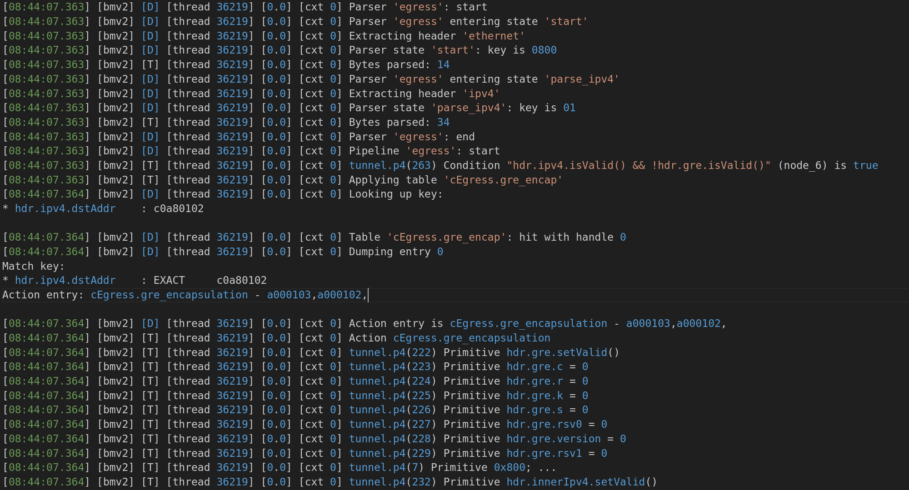
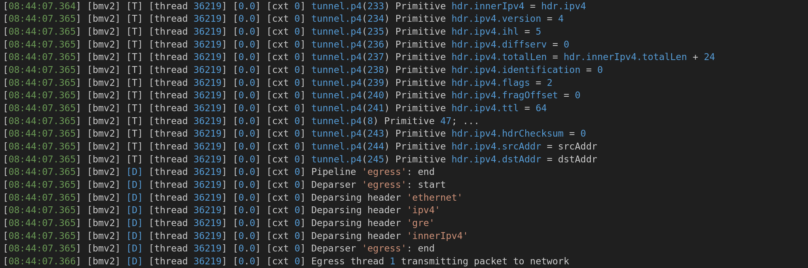
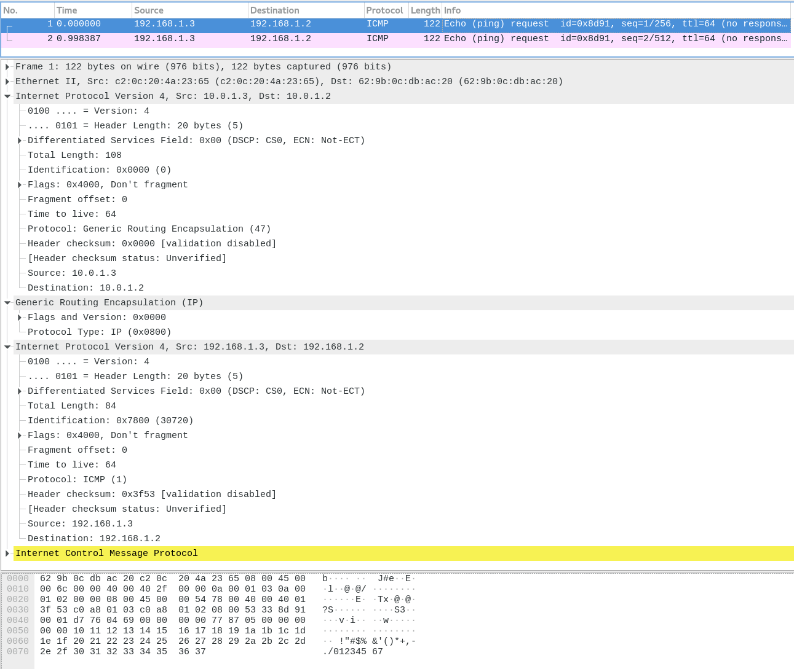
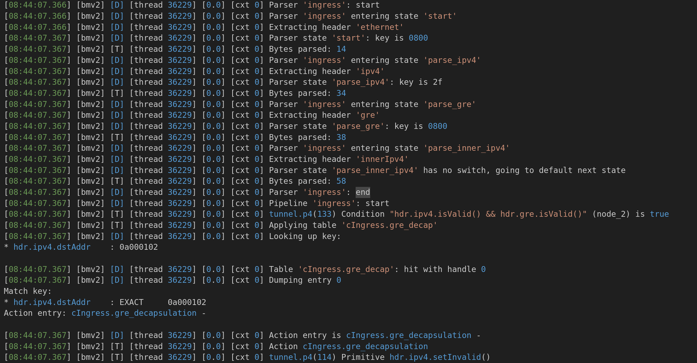
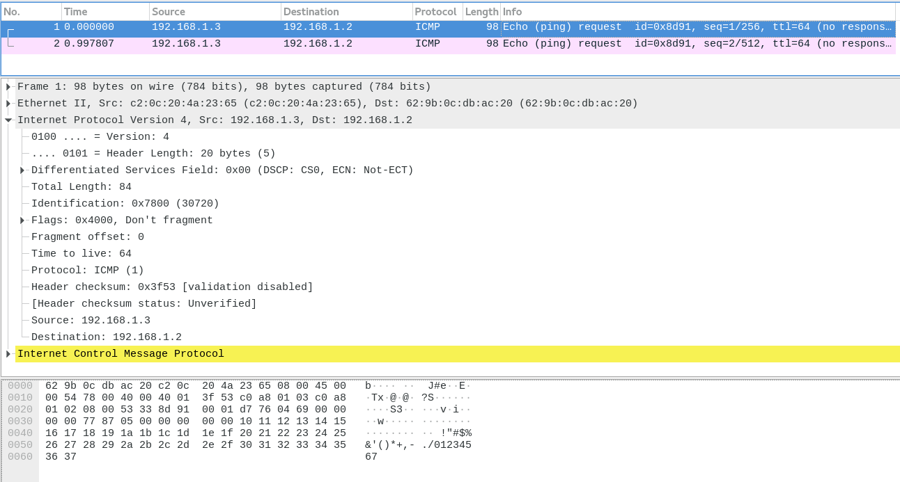

# Tuna P4测试例子：私网IP主机通过GRE隧道在公网IP网段互ping

## 介绍
该例子用于GRE隧道封装解封装功能，以私网IP主机在公网IP网段的相互ping通的功能来进行验证。

## 模拟器验证
通过make TOPO=topology.json指定执行的topo，可以扩展支持更多场景的bmv2验证。
- topology.json：2个nic直连
```bash
   主机1 ─── 网卡1 ─── 网卡2 ─── 主机2
```

## 方案设计
- demo方案：
  - 组网topo：两个主机通过网卡直连，两个主机配置私网IP（192.168.1.x），两个网卡通过公网IP（10.0.1.x）连接
  - ingress输入ethernet - ipv4，封装加上一层ipv4和gre，变成ethernet - ipv4 - gre - ipv4（原始ipv4）
  - egress输入ethernet - ipv4 - gre - ipv4，解封装去掉一层ipv4和gre，变成ethernet - ipv4（原始ipv4）
  - 封装时用原始ipv4的dstAddr（私网IP）查gre_encap_table进行封装动作，解封装时用封装ipv4的dstAddr（公网IP）查gre_decap_table进行解封装动作
  - 输出log打印和解析pcap文件做相应预期
- demo在模拟器上的效果展示：
  - 主机1发送报文，tuna_nic1收到主机1报文
  
  - 报文在tuna_nic1中的处理，egress方向（GRE封装）
  
  - 报文经过tuna_nic1 egress处理后发出给tuna_nic2，两个nic直连，tuna_nic2收到网络报文
  
  - 报文在tuna_nic2中的处理，ingress方向（GRE解封装）
  
  - 报文经过tuna_nic2 ingress处理后发出给主机2
  
